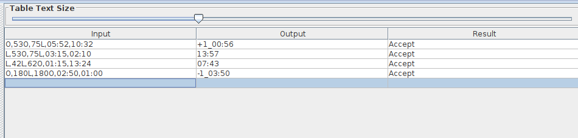

# Viagem pelo mundo - Turing machine

## Execução
1. Execute o arquivo [JFLAP7.1.jar](https://github.com/andrewalkermo/viagem-pelo-mundo/blob/16bdac7a7ad58a779ba197ca56d132e4f38e89c9/JFLAP7.1.jar)
2. Selecione a opção "Turing Machine with Building blocks"
3. Abra o arquivo `viagem_pelo_mundo.jff`

## Especificação
* Especificação do projeto está no arquivo [Projeto - A viagem pelo mundo (mt).pdf](https://github.com/andrewalkermo/viagem-pelo-mundo/blob/16bdac7a7ad58a779ba197ca56d132e4f38e89c9/Projeto%20-%20A%20viagem%20pelo%20mundo%20(mt).pdf)

## Documentação

## Entrada
* ### Formato
  * [[SENTIDO]](#SENTIDO),[[LONGITUDE_ORIGEM]](#LONGITUDE_ORIGEM),[[LONGITUDE_DESTINO]](#LONGITUDE_DESTINO),[[DURACAO_VIAGEM]](#DURACAO_VIAGEM),[[HORA_LOCAL]](#HORA_MINUTO)
* ### Exemplo
  * [O](#SENTIDO),[53O](#LONGITUDE_ORIGEM),[75L](#LONGITUDE_DESTINO),[05:52](#DURACAO_VIAGEM),[10:32](#HORA_MINUTO)

## Saída
* ### Formato
  * [[HORA_FINAL]](#HORA_FINAL)
* ### Exemplo
  * [09:10](#HORA_FINAL)
  * [+1_10:54](#HORA_FINAL)
  * [-1_13:41](#HORA_FINAL)

## SENTIDO
* ### Formato
  * Letra "O" para Oeste ou "L" para Leste
* ### Exemplo
  * O
## LONGITUDE_ORIGEM
* ### Formato
  * decimal, seguido da letra "O" para Oeste ou "L" para Leste
* ### Exemplo
  * 32L

## LONGITUDE_DESTINO
* ### Formato
  * decimal, seguido da letra "O" para Oeste ou "L" para Leste
* ### Exemplo
  * 59O

## DURACAO_VIAGEM
* ### Formato
  * HORA_MINUTO (HH:ii)
* ### Exemplo
  * 15:32

## HORA_MINUTO
* ### Formato
  * HORA_MINUTO (HH:ii)
* ### Exemplo
  * 22:01

## HORA_FINAL
* ### Formato
  * Indicador de dias positivo ou negativo, seguido da hora no lugar de destino.
* ### Exemplo
  * 09:10
  * +1_10:54
  * -2_13:41
